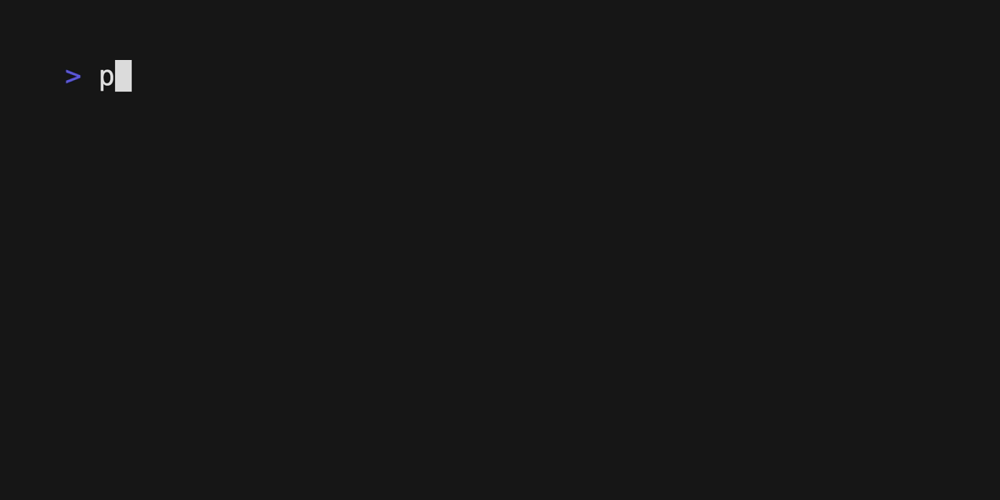

# Chapter 04: Character Grid and List Joiner



## Character Grid

This code defines a Temporal workflow that takes a 2D grid of characters and prints it in a specific format. It consists of two parts:

- An activity that takes a `CharacterGridInput` object containing a 2D grid of characters, and prints it in a specific format.
- A workflow that takes a 2D grid of characters and passes it as input to the `print_grid` activity.

```python
poetry run python character_grid.py
```

## List Joiner

This code defines a workflow and activity that join a list of strings into a sentence. The resulting sentence has a comma and a space between each item, except for the last two items, which are separated by the word "and".

```python
poetry run python list_joiner.py
```
