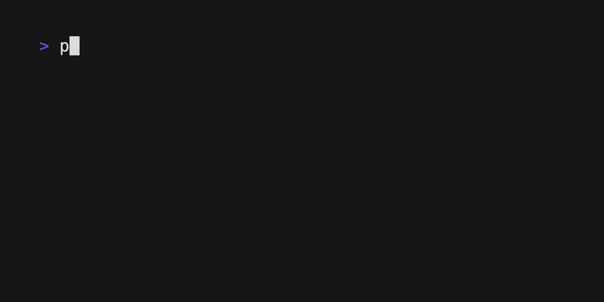

# Chapter 06: Pretty print table



This is a Python program that uses Temporal to format a given list of sublists into a properly aligned table version and returns it as a string.

```python
poetry run python table_printer.py
```