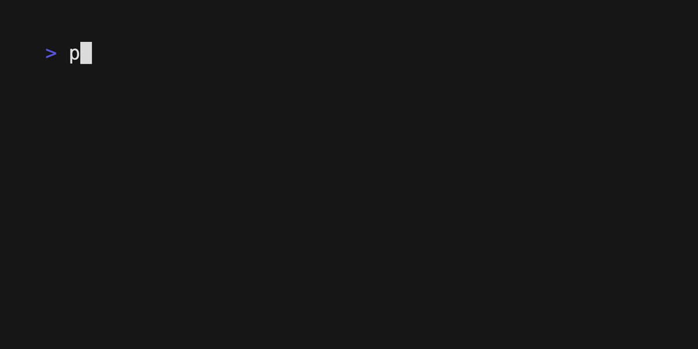

# Chapter 08: Madlib



The MadLibs program is a fun application that allows users to fill in the blanks of a story with their own words to create a unique and hilarious story. This program automates the process by asking the user to input specific types of words such as nouns, verbs, adverbs, and adjectives to fill in the blanks of a story that is read from a text file. The resulting story is then printed to the console.

## Usage

```python
poetry run python mad_lib.py
```

Follow the prompts in the console to enter your own words to fill in the blanks of the story.
Once you have filled in all the blanks, the resulting story will be printed to the console.

This demonstrates how to read from a file with an Activity.
