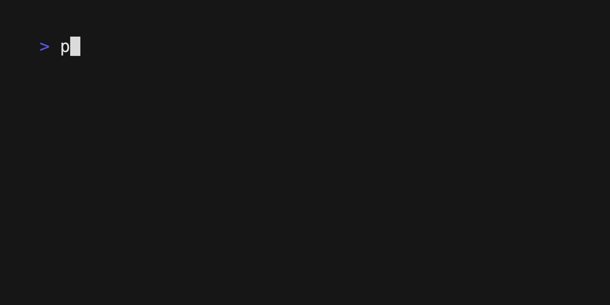

# Chapter 17: Stopwatch



This is a Python program that implements a stopwatch with additional functionality to copy the latest lap time to the clipboard. The stopwatch is started when the user presses the Enter key and stopped (i.e., a lap is recorded) when they press it again.

The program is designed to be run as a workflow on the Temporal server. The Temporal framework provides support for distributed systems and long-running applications that require fault-tolerance and resilience.

## Usage

```python
poetry run python stopwatch.py
```

Once the program is running, press the Enter key to start the stopwatch. Press Enter again to record a lap time. The latest lap time will be copied to the clipboard. To quit the program, press Ctrl-c.

When you pass a keyboard interruption error to the Workflow, it will send a Cancellation request.
This demonstrates how to run a local Activity.